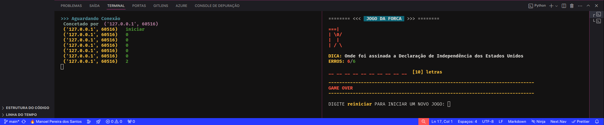
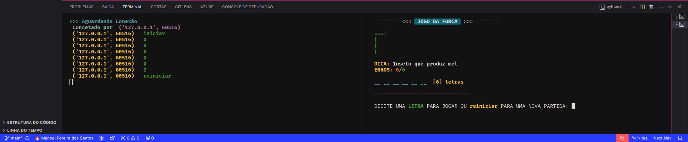
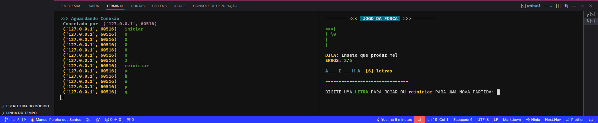
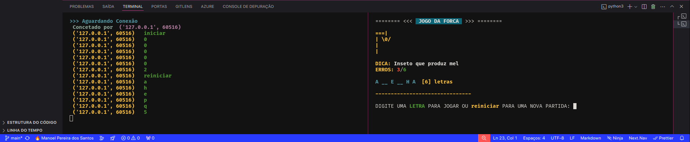
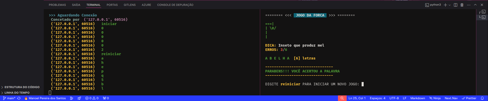

# Jogo-da-Forca-Com-Socket-Em-Python

Jogo da Forca Com Socket Escrito Em Python

[Python](https://www.python.org/)

## Getting Started

1 - Primeiro, certifique-se que tenha o python instalado (versão mínima recomendada 3.10.0):

2 - Faça o clone do projeto e execute o servidor e depois o cliente, para que possa ver o resultado

##

